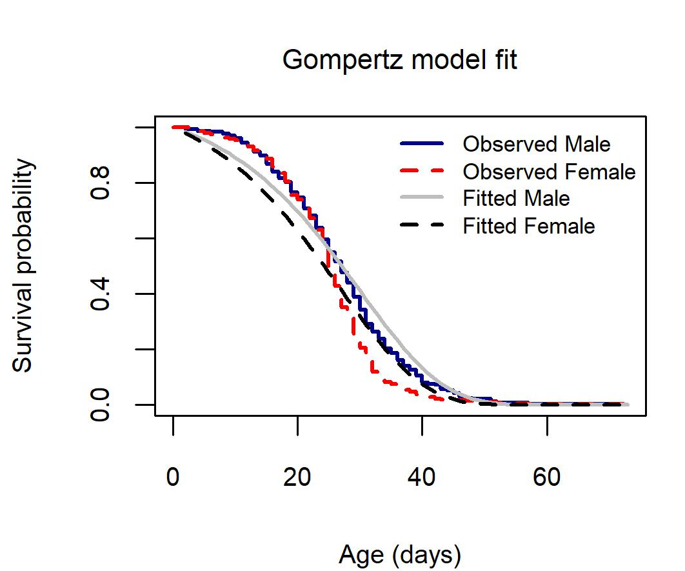
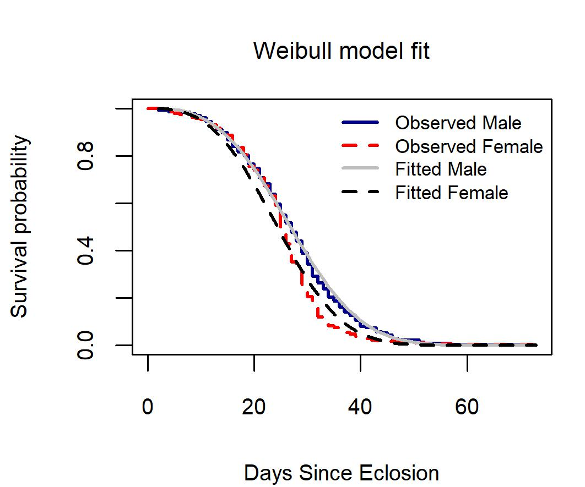

# Setting Up

```{r}
library(flexsurv)
library(ggplot2)
library(tidyverse)
library(ggfortify)# for `autoplot` with survfit
library(survminer)
library(kableExtra)
library(muhaz)
```

## Load previously 'cleaned' dataset

```{r}
load(file = "../Input_Data/monsurv.Rdata")
```

## Function for saving files
```{r}
save_file <- function(test_obj, label, file){

  cat(
    "\n-----------------------------------\n",
    label,
    "\n-----------------------------------\n",
    file = file,
    append = TRUE
  )

  capture.output(
    test_obj,
    file = file,
    append = TRUE
  )
}
```


# Choose Model Family

We need to decide whether to use a Gompertz or Weibull survival model. To do this, we will fit three models using each family, and compare them. The three models are:

-   Null (`~ 1`)

-   Sex (`~ Sex`)

-   Sex and Size (`~Sex + Size`)

## Fit model families

First, create the survival object.

```{r}
survMon <- Surv(monsurv$Age, monsurv$event)
```

Then we can fit each set of params for each model family.

### Fit Gompertz

```{r}
fit_gp_null <- flexsurvreg(
  survMon ~ 1,
  data = monsurv,
  dist = "gompertz"
)

fit_gp_sex <- flexsurvreg(
  survMon ~ Sex,
  data = monsurv,
  dist = "gompertz"
)

fit_gp_sex_size <- flexsurvreg(
  survMon ~ Sex + FWdc_z,
  data = monsurv,
  dist = "gompertz"
)
```

### Fit Weibull

```{r}
fit_wb_null <- flexsurvreg(
  survMon ~ 1,
  data = monsurv,
  dist = "weibullPH"
)

fit_wb_sex <- flexsurvreg(
  survMon ~ Sex,
  data = monsurv,
  dist = "weibullPH"
)

fit_wb_sex_size <- flexsurvreg(
  survMon ~ Sex + FWdc_z,
  data = monsurv,
  dist = "weibullPH"
)
```

### Shape models:Gompertz and Weibull

```{r}
fit_wb_shape_sex <- flexsurvreg(
  survMon ~ 1,
  anc = list(shape = ~ Sex),
  data = monsurv,
  dist = "weibullPH"
)

fit_wb_full_sex <- flexsurvreg(
  survMon ~ Sex,
  anc = list(shape = ~ Sex),
  data = monsurv,
  dist = "weibullPH"
)

fit_gp_shape_sex <- flexsurvreg(
  survMon ~ 1,
  anc = list(shape = ~ Sex),
  data = monsurv,
  dist = "gompertz"
)

fit_gp_full_sex <- flexsurvreg(
  survMon ~ Sex,
  anc = list(shape = ~ Sex),
  data = monsurv,
  dist = "gompertz"
)
```

## Model comparison tables

## Initalize statistics output file

```{r}
model_comparison <- "../Results/Parametric_Monarch/Statistics/model_comparison.txt"

cat(
  "Monarch Manuscript Survival Results\n",
  "=================================\n\n",
  file = model_comparison
)
```

### Compare models with shape to the null

```{r}
fit_tbl2 <- tibble(
  model_name = c("wb_shape_sex", "wb_full_sex", "gp_shape_sex", "gp_full_sex"),
  family = c("Weibull", "Weibull", "Gompertz", "Gompertz"),
  formula = c("~1 ; shape~Sex", "~Sex ; shape~Sex",
              "~1 ; shape~Sex", "~Sex ; shape~Sex"),
  fit = list(fit_wb_shape_sex, fit_wb_full_sex, fit_gp_shape_sex, fit_gp_full_sex)
) %>%
  mutate(
    npars  = map_int(fit, ~ length(coef(.x))),
    logLik = map_dbl(fit, ~ as.numeric(logLik(.x))),
    AIC    = map_dbl(fit, AIC),
    BIC    = map_dbl(fit, BIC)
  ) %>%
  arrange(AIC)

table_one <- fit_tbl2 %>%
  select(model_name, family, formula, npars, logLik, AIC, BIC) %>%
  kbl() %>%
  kable_classic("striped") %>%
  scroll_box(width = "100%")
```

```{r}
save_file(table_one,"Comparison of parametric models: models with sex impacting shape vs. null models", model_comparison)
```
### Main model comparison

```{r}
fit_tbl <- tibble(
  model_name = c(
    "wb_null", "wb_sex", "wb_sex_size",
    "gp_null", "gp_sex", "gp_sex_size"
  ),
  family = c(
    "Weibull", "Weibull", "Weibull",
    "Gompertz", "Gompertz", "Gompertz"
  ),
  formula = c(
    "~ 1", "~ Sex", "~ Sex + FWdc_z",
    "~ 1", "~ Sex", "~ Sex + FWdc_z"
  ),
  fit = list(
    fit_wb_null, fit_wb_sex, fit_wb_sex_size,
    fit_gp_null, fit_gp_sex, fit_gp_sex_size
  )
) %>%
  mutate(
    npars  = map_int(fit, ~ length(coef(.x))),
    logLik = map_dbl(fit, ~ as.numeric(logLik(.x))),
    AIC    = map_dbl(fit, AIC),
    BIC    = map_dbl(fit, BIC)
  ) %>%
  arrange(AIC)

table_two <- fit_tbl %>%
  select(model_name, family, formula, npars, logLik, AIC, BIC) %>%
  kbl() %>%  kable_classic("striped") %>% 
  scroll_box(width = "100%")
```

```{r}
save_file(table_two,"Comparison of parametric models: null models vs. Sex models vs. Forewing + Sex models", model_comparison)
```

### Delta AIC/BIC (Weibull vs Gompertz)
```{r}
modelDeltas <- matrix(nrow = 3, ncol = 2)
rownames(modelDeltas) <- unique(fit_tbl$formula)
colnames(modelDeltas) <- c("AIC", "BIC")

for (form in unique(fit_tbl$formula)) {
  tmp_tbl <- fit_tbl[fit_tbl$formula == form, ]
  modelDeltas[form, "AIC"] <- tmp_tbl$AIC[tmp_tbl$family == "Gompertz"] - 
                              tmp_tbl$AIC[tmp_tbl$family == "Weibull"]
  modelDeltas[form, "BIC"] <- tmp_tbl$BIC[tmp_tbl$family == "Gompertz"] - 
                              tmp_tbl$BIC[tmp_tbl$family == "Weibull"]
}

modelDeltas <- fit_tbl %>%
  select(family, formula, AIC, BIC) %>%
  tidyr::pivot_wider(
    names_from = family,
    values_from = c(AIC, BIC)
  ) %>%
  mutate(
    `ΔAIC (Gompertz - Weibull)` = AIC_Gompertz - AIC_Weibull,
    `ΔBIC (Gompertz - Weibull)` = BIC_Gompertz - BIC_Weibull
  ) %>%
  select(
    formula,
    `ΔAIC (Gompertz - Weibull)`,
    `ΔBIC (Gompertz - Weibull)`
  )
print(modelDeltas)
```
All the values are positive, meaning the Gompertz models have substantially larger AIC/BIC than the corresponding Weibull models, so the Weibull family is preferred for every predictor set.

```{r}
save_file(modelDeltas,"Gompertz-Weibull for each of the models formulas", model_comparison)
```

### Kaplan-Meier + model fits

Next, we will visualize the model fits to the data as well. First, a basic Kaplan Meier fit.

```{r}
km_sex <- survfit(survMon ~ Sex, data = monsurv)
```

Plot Kaplan Meier data visualization and overlay the predicted model fits (and save them).

Note the use of lines(), which invokes the method lines.flexsurvreg() function to add fitted lines to the existing Kaplan Meier plot. This is a handy convenience function! It is important to specify newdata= in order to get seperate lines for each factor in Sex.


```{r}
jpeg(
  "../Results/Parametric_Monarch/Figures/Figure_01_Gompertz.jpg",
  width = 90,
  height = 75,
  units = "mm",
  res = 300
)

par(
  mar = c(4,4,3,1),
  cex.main = 0.85,
  font.main = 1,
  cex.lab = 0.8,   
  cex.axis = 0.8
)

plot(
  km_sex,
  col = c("darkblue", "red"),
  lty = c(1, 2),      
  lwd = 2,
  conf.int = FALSE,
  mark.time = FALSE,
  xlim = c(0, max(monsurv$Age)),
  ylim = c(0, 1),
  xlab = "Age (days)",
  ylab = "Survival probability",
  main = "Gompertz model fit"
)

lines(
  fit_gp_sex,
  newdata = data.frame(Sex = levels(monsurv$Sex)),
  col = c("gray", "black"),
  lty = c(1, 2),
  lwd = 2
)

legend(
  "topright",
  legend = c(
    "Observed Male",
    "Observed Female",
    "Fitted Male",
    "Fitted Female"
),
  col = c("darkblue", "red", "gray", "black"),
  lty = c(1, 2, 1, 2),
  lwd = 2,
  bty = "n",
  cex = 0.7
)

dev.off()
```

```{r}
jpeg(
  "../Results/Parametric_Monarch/Figures/Figure_02_Weibull.jpg",
  width = 90,
  height = 75,
  units = "mm",
  res = 300
)

par(
  mar = c(4,4,3,1),
  cex.main = 0.85,
  font.main = 1,
  cex.lab = 0.8,    
  cex.axis = 0.8
)

plot(
  km_sex,
  col = c("darkblue", "red"),
  lty = c(1, 2),
  lwd = 2,
  conf.int = FALSE,
  mark.time = FALSE,
  xlim = c(0, max(monsurv$Age)),
  ylim = c(0, 1),
  xlab = "Days Since Eclosion",
  ylab = "Survival probability",
  main = "Weibull model fit"
)

lines(
  fit_wb_sex,
  newdata = data.frame(Sex = levels(monsurv$Sex)),
  col = c("gray", "black"),
  lty = c(1, 2),
  lwd = 2
)

legend(
  "topright",
  legend = c(
    "Observed Male",
    "Observed Female",
    "Fitted Male",
    "Fitted Female"
  ),
  col = c("darkblue", "red", "gray", "black"),
  lty = c(1, 2, 1, 2),
  lwd = 2,
  bty = "n",
  cex = 0.7
)

dev.off()
```

## Gompertz model

```{r echo=FALSE, fig.align='center', out.width='70%'}

```

## Weibull model

```{r echo=FALSE, fig.align='center', out.width='70%'}

```

In this visual contrast, the Weibull model is clearly a better fit, consistent with the AIC & BIC results.

### Hazard smoothing (muhaz)

Another way to visualize this is to plot empirical hazard rates for each sex over time along side fitted values.

Typically, we would get hazard rates by calculating the period mortality (qx) at each day. But a good alternative in this case is to use the muhaz package to get a “kernal-smoothed” estimate, which provides a more continuous version of the observed values, and makes for a better comparison to the continuous-time parametric modeling.

#### Smoothed empirical hazards

Obtain smoothed male and female hazards from the data.
```{r}
# split by sex
haz_female <- muhaz(
  times = monsurv$Age[monsurv$Sex == "Female"],
  delta = monsurv$event[monsurv$Sex == "Female"]
)

haz_male <- muhaz(
  times = monsurv$Age[monsurv$Sex == "Male"],
  delta = monsurv$event[monsurv$Sex == "Male"]
)
```

Then bind these two together into a “tidy” dataframe. We filter to remove early values == 0 to avoid infinity values in log-transformation
```{r}
emp_haz_df <- bind_rows(
  data.frame(
    time = haz_female$est.grid,
    hazard = haz_female$haz.est,
    Sex = "Female"
  ),
  data.frame(
    time = haz_male$est.grid,
    hazard = haz_male$haz.est,
    Sex = "Male"
  )
) %>% filter(hazard > 0)
```

### Plot Smoothed Hazard Rates
```{r}
smoothedhazard <- ggplot() +
  geom_line(
    data = emp_haz_df,
    aes(x = time, y = log(hazard), colour = Sex),
    linewidth = 1
  ) +
  theme_bw() +
  scale_color_manual(values = c("red", "darkblue")) +
  ggtitle("Smoothed Hazard Rates")
print(smoothedhazard)
```

#### Save smoothed hazard plot
```{r}
ggsave(
  filename = "../Results/Parametric_Monarch/Figures/Figure_03_smoothedhazard.jpg",
  plot = smoothedhazard,
  width = 180,    
  height = 120,
  units = "mm",
  dpi = 300
)
```

### Predicted values
Now we use the models to obtain predicted values of hazard rates across the relevant time range.
```{r}
tgrid <- seq(
  from = min(monsurv$Age, na.rm = TRUE),
  to   = max(monsurv$Age, na.rm = TRUE),
  length.out = 200
)

sex_levels <- levels(monsurv$Sex)

# Weibull predictions
wb_pred <- summary(
  fit_wb_sex,
  t = tgrid,
  newdata = data.frame(Sex = sex_levels),
  type = "hazard"
)

# Convert nested output to long data frame
wb_pred_df <- as_tibble(wb_pred) %>%
  pivot_longer(
    cols = everything(),
    names_to = "Sex=",
    values_to = "pred"
  ) %>%
  unnest(pred) %>%
  mutate(model = "Weibull")
wb_pred_df$Sex <- sub(pattern = "Sex=", x = wb_pred_df$"Sex=", replacement = "")

# Gompertz predictions
gp_pred <- summary(
  fit_gp_sex,
  t = tgrid,
  newdata = data.frame(Sex = sex_levels),
  type = "hazard"
)

gp_pred_df <- as_tibble(gp_pred) %>%
  pivot_longer(
    cols = everything(),
    names_to = "Sex=",
    values_to = "pred"
  ) %>%
  unnest(pred) %>%
  mutate(model = "Gompertz")
gp_pred_df$Sex <- sub(pattern = "Sex=", x = gp_pred_df$"Sex=", replacement = "")

pred_haz_df <- bind_rows(wb_pred_df, gp_pred_df) #%>% filter(est > 0)
```

### Plot smoothed vs predicted values

And with both “smoothed” values from the data, and the predicted values from the models, we can overlay them. It becomes very apparent that the Weibull is a better fit to the data, even just when we are considering Sex without any size variation.

```{r}
predicted_smoothed <- ggplot() +
  geom_line(
    data = emp_haz_df,
    aes(x = time, y = log(hazard)),
    color = "black",
    linetype = "dashed",
    linewidth = 1
  ) +
  geom_line(
    data = pred_haz_df,
    aes(x = time, y = log(est), color = model),
    linewidth = 1
  ) +
  facet_wrap(~Sex) +
  labs(
    x = "Age (days)",
    y = "log(Hazard)",
    title = "Empirical and parametric log-hazard curves by sex"
  ) +
  theme_bw()
print(predicted_smoothed)
```

#### Save 'predicted_smoothed' plot

```{r}
ggsave(
  filename = "../Results/Parametric_Monarch/Figures/Figure_04_predicted_vs_smoothed_hazard.jpg",
  plot = predicted_smoothed,
  width = 180,    
  height = 120,
  units = "mm",
  dpi = 300
)
```

# Test shape parameters

Having established that the Weibull model is better for our data, we will proceed with model comparisons to test whether there is evidence for significant variation in shape, indicating that there is a difference in aging.

We will focus on 4 models:

-   M1: Sex + Size on the main (scale) parameter only

-   M2: M1 + Sex on shape

-   M3: M1 + Size on shape

-   M4: M1 + Sex + Size on shape

In this framework, we are already assuming (i.e. not testing for) a “main” effect on scale from both Sex and Size. In other words, our “null” model starts with an assumption of these two parameters impacting the survival.

What we are most keen to assess is whether adding Sex as a predictor to shape provides a significant improvement to the model fit. This would provide evidence that Sex impacts the age-specific hazard function. Significant differences between M2 vs M1, or M4 vs M3, would indicate Sex is a significant factor in the age-specific hazard function.

## Fit models

```{r}
# M1: sex + size on main parameter only
M1fit_wb_main <- flexsurvreg(
  survMon ~ Sex + FWdc_z,
  data = monsurv,
  dist = "weibullPH"
)

# M2: add sex on shape
M2fit_wb_shape_sex <- flexsurvreg(
  survMon ~ Sex + FWdc_z,
  anc = list(shape = ~ Sex),
  data = monsurv,
  dist = "weibullPH"
)

# M3: add size on shape
M3fit_wb_shape_size <- flexsurvreg(
  survMon ~ Sex + FWdc_z,
  anc = list(shape = ~ FWdc_z),
  data = monsurv,
  dist = "weibullPH"
)

# M4: add both sex and size on shape
M4fit_wb_shape_both <- flexsurvreg(
  survMon ~ Sex + FWdc_z,
  anc = list(shape = ~ Sex + FWdc_z),
  data = monsurv,
  dist = "weibullPH"
)
```

## Extract parameters

Now extract relevant model fitting parameters for comparisons.

```{r}
fit_compare <- tibble(
  model = c(
    "M1_main_only",
    "M2_shape_sex",
    "M3_shape_size",
    "M4_shape_sex_size"
  ),
  fit = list(
    M1fit_wb_main,
    M2fit_wb_shape_sex,
    M3fit_wb_shape_size,
    M4fit_wb_shape_both
  )
) %>%
  mutate(
    npars  = map_int(fit, ~ length(coef(.x))),
    logLik = map_dbl(fit, ~ as.numeric(logLik(.x))),
    AIC    = map_dbl(fit, AIC),
    BIC    = map_dbl(fit, BIC)
  ) %>%
  arrange(AIC)

fit_compare %>%
  select(model, npars, logLik, AIC, BIC) %>%   
  kbl() %>%  kable_classic("striped") %>% 
  scroll_box(width = "100%")
```

```{r}
save_file(fit_compare,"Weibull: Model comparisons to determine the metrics that effect shape", model_comparison)
```


Using AIC, the established precedent, a difference of over 2 is the basic threshold for a “significant” difference, and over 4 is “strong” support. BIC follows a similar pattern.

AIC suggests that the “full” model (M4) with both Sex and Size is the best model overall, supporting the hypothesis that Sex is an important mediator of age-specific mortality. However, there is essentially no difference between models that include Sex as a predictor for shape versus the basic model (ex) M1 vs M2).

BIC contrasts with AIC, and does not indicate any meaningful improvement in model fit between M4 vs M3.

To resolve this we can turn to LRTs, which are arguably a stronger test of model fits, which we can do because several of these models are nested.

## Test model fits

We assess a significant improvement in model fit using a LRT. In many cases, model comparisons via LRT can be directly done by the anova()function. But it seems flexsurvreg objects don’t support this, so we need a custom function to do this.

```{r}
doLRT <- function(fitMore, fitLess) {
  lrt_stat <- 2 * (as.numeric(logLik(fitMore)) - as.numeric(logLik(fitLess)))
  df_diff  <- attr(logLik(fitMore), "df") - attr(logLik(fitLess), "df")
  p_value  <- pchisq(lrt_stat, df = df_diff, lower.tail = FALSE)

  tibble(
    lrt = lrt_stat,
    df = df_diff,
    p = p_value
  )
}
```

Now we will do several model comparisons and summarize the various results at the end.

```{r}
# M2vM1 Does sex affect shape, beyond main effects?
M2vM1 <- doLRT(M2fit_wb_shape_sex, M1fit_wb_main)

# M3_v1 Does size affect shape, beyond main effects?
M3vM1 <- doLRT(M3fit_wb_shape_size, M1fit_wb_main)

# M4vM2 Does adding both improve over sex-on-shape only?
M4vM2 <- doLRT(M4fit_wb_shape_both, M2fit_wb_shape_sex)

# M4vM3 Does adding both improve over size-on-shape only?
M4vM3 <- doLRT(M4fit_wb_shape_both, M3fit_wb_shape_size)

# M4vM3Does adding both improve over main-only?
M4vM1 <- doLRT(M4fit_wb_shape_both, M1fit_wb_main)

lrts <- bind_rows(M2vM1, M3vM1, M4vM2, M4vM3, M4vM1)
lrts <- bind_cols(comparison = c("M2vM1", 
                                 "M3vM1", 
                                 "M4vM2", 
                                 "M4vM3", 
                                 "M4vM1"),
                  Description = c("Sex vs Null", 
                                  "Size vs Null", 
                                  "Both vs SexOnly", 
                                  "Both vs SizeOnly", 
                                  "Both vs Null"),
                  lrts)

lrts %>% kbl() %>%  kable_classic("striped") %>% 
  scroll_box(width = "100%")
```

```{r}
save_file(lrts,"Direct model comparisons to determine the best fit Weibull model", model_comparison)
```

The LRTs provide additional support for a significant effect of sex, so long as we have size already in the model. This makes some intuitive sense, because size and sex are strongly related, as males are larger than females. So to detect the effect of sex, we need to account for size in the model as well.

```{r}
sessionInfo()
```
